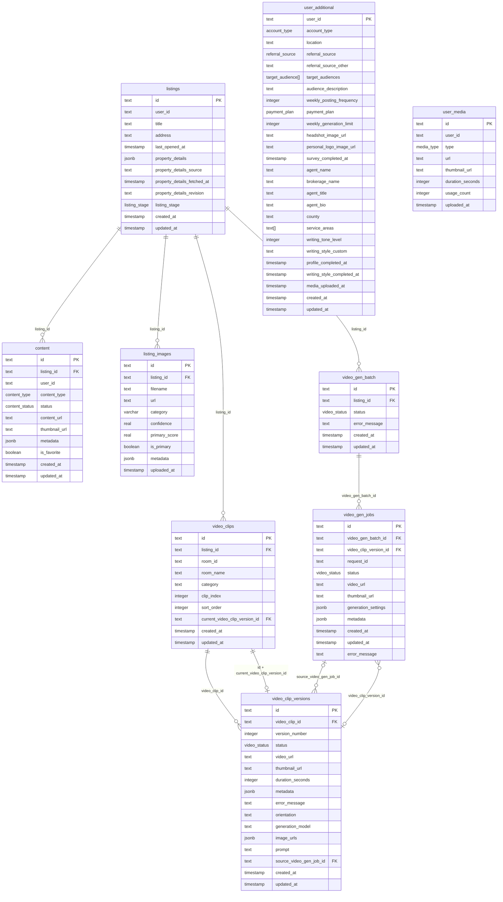

# Database ERD

This diagram is a human-facing snapshot of the current DB relationships in `@zencourt/db`.
The source of truth remains the Drizzle schema in `packages/db/drizzle/schema/*`.

## Mermaid ERD

## Notes

- `user_additional.user_id` and `user_media.user_id` are user-owned identifiers, but there is no DB-level foreign key to an `auth.users` table inside this package.
- `video_clips.current_video_clip_version_id` is enforced together with `video_clips.id`, so the selected version must belong to that same clip.
- `video_gen_jobs.video_clip_version_id` points to the version a job is associated with.
- `video_clip_versions.source_video_gen_job_id` points back to the job that created that version.
